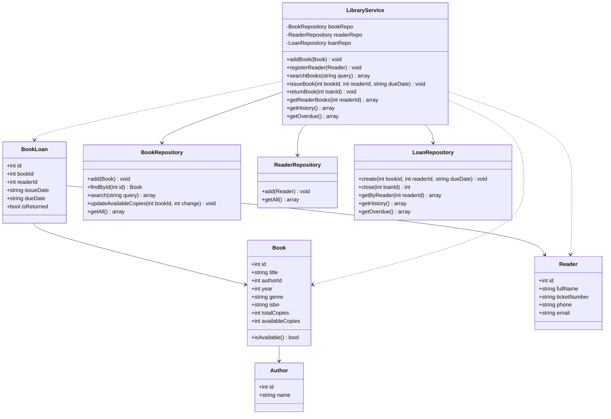

```mermaid
classDiagram
    class Book {
        +int id
        +string title
        +int authorId
        +int year
        +string genre
        +string isbn
        +int totalCopies
        +int availableCopies
        +isAvailable() bool
    }
    
    class Author {
        +int id
        +string name
    }
    
    class Reader {
        +int id
        +string fullName
        +string ticketNumber
        +string phone
        +string email
    }
    
    class BookLoan {
        +int id
        +int bookId
        +int readerId
        +string issueDate
        +string dueDate
        +bool isReturned
    }

    class BookRepository {
        +add(Book) void
        +findById(int id) Book
        +search(string query) array
        +updateAvailableCopies(int bookId, int change) void
        +getAll() array
    }
    
    class ReaderRepository {
        +add(Reader) void
        +getAll() array
    }
    
    class LoanRepository {
        +create(int bookId, int readerId, string dueDate) void
        +close(int loanId) int
        +getByReader(int readerId) array
        +getHistory() array
        +getOverdue() array
    }

    class LibraryService {
        -BookRepository bookRepo
        -ReaderRepository readerRepo
        -LoanRepository loanRepo
        +addBook(Book) void
        +registerReader(Reader) void
        +searchBooks(string query) array
        +issueBook(int bookId, int readerId, string dueDate) void
        +returnBook(int loanId) void
        +getReaderBooks(int readerId) array
        +getHistory() array
        +getOverdue() array
    }

    Book --> Author
    BookLoan --> Book
    BookLoan --> Reader
    
    LibraryService --> BookRepository
    LibraryService --> ReaderRepository
    LibraryService --> LoanRepository
    
    LibraryService ..> Book
    LibraryService ..> Reader
    LibraryService ..> BookLoan

```
