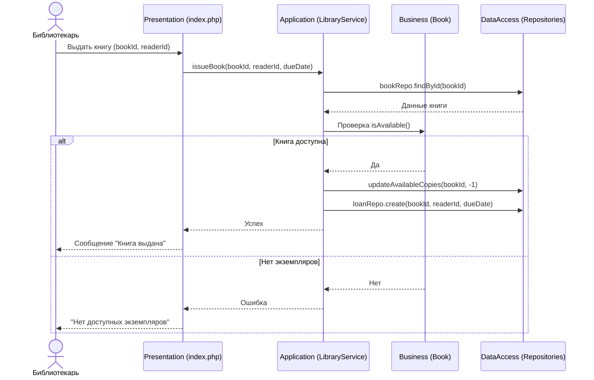

```mermaid
sequenceDiagram
    actor User as Библиотекарь
    participant UI as Presentation (index.php)
    participant App as Application (LibraryService)
    participant Biz as Business (Book)
    participant DB as DataAccess (Repositories)

    User->>UI: Выдать книгу (bookId, readerId)
    UI->>App: issueBook(bookId, readerId, dueDate)
    
    App->>DB: bookRepo.findById(bookId)
    DB-->>App: Данные книги
    
    App->>Biz: Проверка isAvailable()
    
    alt Книга доступна
        Biz-->>App: Да
        App->>DB: updateAvailableCopies(bookId, -1)
        App->>DB: loanRepo.create(bookId, readerId, dueDate)
        App-->>UI: Успех
        UI-->>User: Сообщение "Книга выдана"
    else Нет экземпляров
        Biz-->>App: Нет
        App-->>UI: Ошибка
        UI-->>User: "Нет доступных экземпляров"
    end
```
